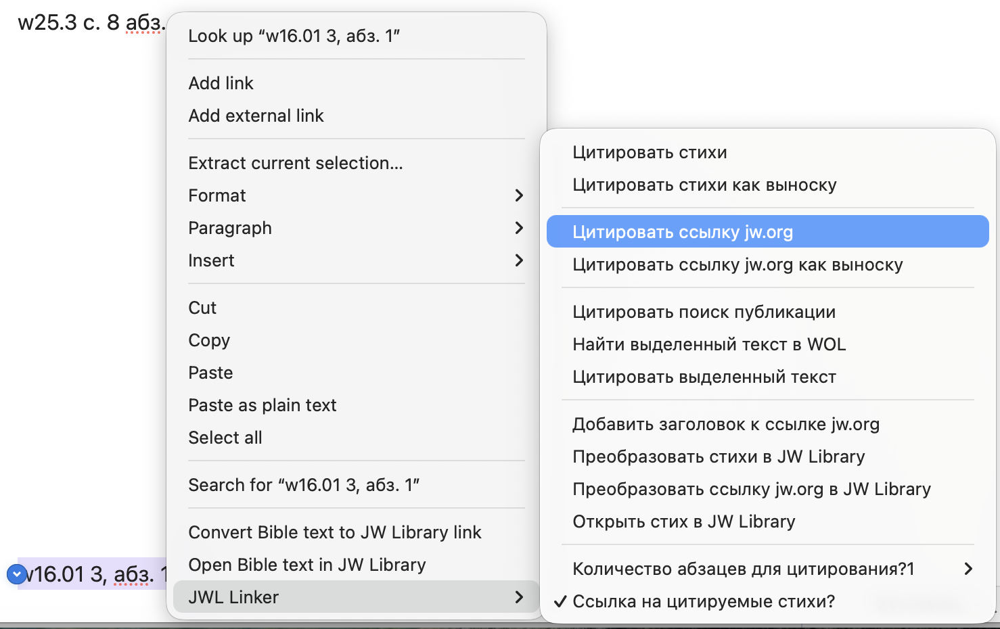

# JWL Linker EN-RU-ES Plugin for [Obsidian](https://obsidian.md)

**Comprehensive multilingual JW Library linker** supporting Bible references and JW publications in **English, Russian, and Spanish**. 

This is a fork of Original plugin by [MrBertie](https://github.com/MrBertie/jwl-linker)

## ✨ Key Features

- 📖 **Bible References**: Automatic conversion to JW Library links with verse text extraction
- 📚 **Publication Support**: Watchtower, Awake!, books (od, it-1, cl, si, etc.) in multiple formats
- 🌍 **Multilingual**: Full English, Russian, and Spanish support with auto-detection
- 🔄 **Auto-formatting**: `od 15 par. 3` → `od chap. 15 par. 3` + Watchtower month names (English/Russian/Spanish)
- 📅 **Year Filtering**: Watchtower availability (Russian: 1986+, English/Spanish: 1950+)
- 🎯 **Dual Mode**: Show publications in multiple languages simultaneously
- 💬 **Smart Citations**: Extract paragraph text with callout formatting
- 📝 **Text Quoting**: Convert selected text to citation callouts

# How to Install

Download the [latest version](https://github.com/argonfatl/jwl-linker-ENRU/archive/refs/heads/main.zip) from this link, and unzip it.  
You see a folder called `jwl-linker-main`; rename this folder as `jwl-linker` and then add it into your `{Obsidian Vault}/.obsidian/plugins` folder.  
Restart Obsidian and go to the *Community Plugins Settings* page to enable the plugin.

*Note: you can also click the `<>Code` button above and choose `Download.zip`*

# 📖 Supported Publication Formats

## Bible References
- **English**: `Rom 1:20`, `1 Cor 9:26`, `Psalm 89:18`
- **Russian**: `Рим 1:20`, `1 Кор 9:26`, `Псалом 89:18`
- **Spanish**: `Rom 1:20`, `1 Cor 9:26`, `Salmo 89:18`

## Watchtower Publications
- **English**: `w65 6/1 p. 329 par. 6`, `w24 1/15 p. 12 par. 3`
- **Russian**: `w86.01 28, абз. 11`, `w24.12 15, абз. 5`
- **Spanish**: `w65 6/1 pág. 329 párr. 6`, `w24 1/15 pág. 12 párr. 3`

## Other Publications
- **English**: `od 15 par. 3`, `it-1 332`, `cl chap. 8 p. 77 par. 2`
- **Russian**: `od 15 абз. 3`, `cl глава 8 с. 77 абз. 2`
- **Spanish**: `od 15 párr. 3`, `cl cap. 8 pág. 77 párr. 2`
- **Page Ranges**: `si pp. 300-301 par. 11`, `si сс. 300-301 абз. 11`, `si págs. 300-301 párr. 11`

## Auto-formatting Examples

### Publication Auto-formatting
- **English**: `od 15 par. 3` → `od chap. 15 par. 3`
- **Russian**: `od 15 абз. 3` → `od глава 15 абз. 3`
- **Spanish**: `od 15 párr. 3` → `od cap. 15 párr. 3`

### Watchtower Month Names Auto-formatting
**Pre-2016 (Two issues per month):**
- **Russian**: `w10 15 Января с. 3 абз. 1` → `w10 1/15 с. 3 абз. 1`
- **English**: `w10 15 January p. 3 par. 1` → `w10 1/15 p. 3 par. 1`
- **Spanish**: `w10 15 Enero pág. 3 párr. 1` → `w10 1/15 pág. 3 párr. 1`

**Post-2016 (One issue per month):**
- **Russian**: `w16 Январь с. 3 абз. 1` → `w16.01 3, абз. 1`
- **English**: `w25 March p. 8 par. 2` → `w25 3/1 p. 8 par. 2`
- **Spanish**: `w25 Marzo pág. 8 párr. 2` → `w25 3/1 pág. 8 párr. 2`

# 🎯 How to Use In Reading View

Displays all valid scripture references as *JW Library* links with automatic language detection.
Open any page with scripture references and switch to *Reading View* to see hyperlinks with full book names.

> Note: This only affects the *Reading View*, it does not modify the underlying Markdown text.

# ⚡ How to Use In Editing View

The plugin provides comprehensive commands for scriptures, publications, and citations.

To access the commands:
- On Desktop: right-click next to the scripture, and hover on *JWL Linker* to see the list of commands.

 
- On Mobile: add a toolbar item for the *JWL Linker* command.

## 📋 Available Commands

| Command                               | Target                          | Result                                                                                  | Action         | 
| -------------------------------------| ------------------------------ | ------------------------------------------------------------------------------------ | ------------- |
| **Cite verses**                      | Scripture reference             | Verse text with JW Library link in plain format                                     | Adds below     | 
| **Cite verses as callout**           | Scripture reference             | Verse text with JW Library link in callout format                                   | Adds below     | 
| **Cite jw.org url**                  | WOL/JW.org URL                  | Article content with navigation title in plain format                               | Adds below     | 
| **Cite jw.org url as callout**       | WOL/JW.org URL                  | Article content with navigation title in callout format                             | Adds below     | 
| **Cite publication lookup**          | Publication reference           | Publication content with auto-formatting and language detection                     | Adds below     | 
| **Lookup selected text on WOL**      | Any text                        | Opens WOL search with selected text                                                  | Opens browser  | 
| **Cite selected text**               | Selected text                   | Wraps text in `[!cite]` callout format                                              | Replaces       |
| **Add title to jw.org url**          | WOL/JW.org URL                  | Adds proper navigation title to existing URL                                         | Replaces       | 
| **Convert scriptures to JW Library** | Scripture reference             | Converts to JW Library markdown link                                                 | Replaces       | 
| **Convert jw.org url to JW Library** | WOL/JW.org URL                  | Converts to JW Library URL                                                           | Replaces       | 
| **Open scripture in JW Library**     | Scripture reference             | Opens scripture directly in JW Library app                                           | Opens app      | 


# 🌍 Multilingual Support

## Language Detection
- **Automatic**: Detects Cyrillic characters for Russian, Spanish Bible book names, defaults to English
- **Manual**: Set preferred language in plugin settings (English/Russian/Spanish)
- **Dual Mode**: Show publications in multiple languages simultaneously

## Publication Availability
- **Russian Watchtower**: Available from 1986 onwards (`w86.01` and later)
- **English/Spanish Watchtower**: Available from 1950 onwards (`w50 1/1` and later)
- **Offline Publications**: Automatic detection with localized messages in all three languages

## Language-Specific Features
- **Auto-formatting**: 
  - English: `par.` ↔ `chap.` ↔ `p.`
  - Russian: `абз.` ↔ `глава` ↔ `с.`
  - Spanish: `párr.` ↔ `cap.` ↔ `pág.`
- **Publication Titles**: Displays in appropriate language
  - "The Watchtower" / "Сторожевая башня" / "La Atalaya"
  - "Awake!" / "Пробудитесь!" / "¡Despertad!"
- **Interface**: Menu items and messages in selected interface language

# 📝 Example Outputs

## Bible Citation (English)
```markdown
Rom 1:20
> [!verse] BIBLE — [Romans 1:20](jwlibrary://...)
> **20** For his invisible qualities are clearly seen from the world's creation onward...
```

## Publication Citation (Russian)
```markdown
w86.01 28, абз. 11
> [!cite] ПУБЛ. — [Сторожевая башня 1986 Январь с. 28 абз. 11](https://wol.jw.org/...)
> **11** Большинство людей сегодня не признают принцип главенства...
```

## Publication Citation (Spanish)
```markdown
od 15 párr. 3
> [!cite] PUBL. — [Organizados para hacer la voluntad de Jehová cap. 15 párr. 3](https://wol.jw.org/...)
> **3** La mayoría de las personas hoy no reconocen el principio de la jefatura...
```

## Dual Mode Output
```markdown
od 15 par. 3
**English:**
> [!cite] PUB. — [Organized to Do Jehovah's Will chap. 15 par. 3](https://wol.jw.org/...)
> **3** Most people today do not recognize the principle of headship...

**Russian:**
> [!cite] ПУБЛ. — [Организованы исполнять волю Иеговы глава 15 абз. 3](https://wol.jw.org/...)
> **3** Большинство людей сегодня не признают принцип главенства...
```

## Text Citation Examples
```markdown
English: "This is important information"
> [!cite] QUOTE
> This is important information

Russian: "Это важная информация"
> [!cite] ЦИТАТА
> Это важная информация

Spanish: "Esta es información importante"
> [!cite] CITA
> Esta es información importante
```

# ⚙️ Plugin Settings

## Display Options
- **Verse Template**: Customize format for Bible verse citations
- **Callout Templates**: Customize format for callout-style citations  
- **Language Settings**: Interface language (Russian/English/Spanish) and citation language
- **Dual Mode**: Enable simultaneous multi-language publication display

## Advanced Options
- **History Size**: Number of recent citations to keep in sidebar
- **Bold Numbers**: Apply bold formatting to verse/paragraph numbers
- **Citation Links**: Enable JW Library links for scripture references
- **Paragraph Count**: Default number of paragraphs to cite

# 🔗 Opening Links

Click any generated link to open directly in your installed *JW Library* app at the exact scripture or publication reference.

# 💡 Tips for Usage

## Command Access Methods
1. **Right-click Menu**: Right-click in editor → hover "JWL Linker" → select command
2. **Command Palette**: `Ctrl/Cmd + P` → type "jw..." → select command
3. **Commander Plugin**: Add commands to toolbar for quick access
4. **Pinned Commands**: Pin frequently used commands in Command Palette

## Best Practices
- **Select text** before running commands for best results
- **Use dual mode** when working with multilingual content
- **Check publication years** - older Watchtowers may not be available online
- **Verify auto-formatting** - plugin automatically adds language-appropriate terms:
  - English: "chap.", "par.", "p."
  - Russian: "глава", "абз.", "с."
  - Spanish: "cap.", "párr.", "pág."
- **Use natural month names** - plugin auto-converts Watchtower month names:
  - Russian: "Январь", "Февраль", "Март", etc.
  - English: "January", "February", "March", etc.
  - Spanish: "Enero", "Febrero", "Marzo", etc.
- **Historical accuracy** - plugin respects pre-2016 two-issue format vs. post-2016 single-issue format

## Supported Publication Codes
- **Books**: `od`, `it-1`, `it-2`, `si`, `cl`, `jv`, `dp`, `ip-1`, `ip-2`, `be`, `th`
- **Periodicals**: `w` (Watchtower), `g` (Awake!), `km`, `mwb`
- **Study Aids**: `lff`, `rr`, `rs`

---

**Version**: 0.6.4 | **Languages**: English, Russian, Spanish | **Platform**: Obsidian Desktop & Mobile

